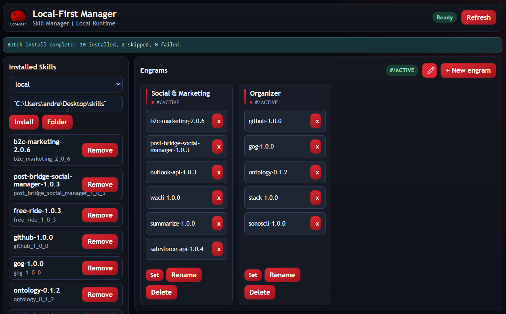

# LobeSter


**LobeSter is the local control panel for OpenClaw skills.**  
Deterministic. Non-destructive. CLI-first.  
Install, group, activate, and safely apply your engrams without breaking your base config.

## Why "LobeSter"?

In the brain, the frontal lobe governs executive control, deciding which patterns of behavior are active.
LobeSter does the same for OpenClaw: it allows you decide which skills are active and applies those patterns without mutating your base config.


Managing OpenClaw skills by hand is error-prone:

- Config JSON drifts over time
- Skills can collide on entry keys
- Context switching means editing config manually
- It is hard to see what is active and why

LobeSter introduces deterministic loadouts called **engrams** - reproducible skill states you can switch instantly without editing config by hand.

## What It Does

- Install skills from local folders or public GitHub repos
- Group installed skills into engrams
- Set an engram with a non-destructive apply flow
- Never mutates your base OpenClaw config in place
- Always produces explicit conflict output
- Generate deterministic OpenClaw output files
- Report conflicts instead of silently overwriting entries
- Manage everything from a local dashboard and CLI

## Philosophy

- Local-first
- Deterministic output
- Explicit conflict reporting
- No silent mutation

## How It Works

LobeSter runs locally and does not mutate your base OpenClaw config in place.

On each engram is set, it writes:

- `~/.lobester/openclaw/overlay.json`
- `~/.lobester/openclaw/openclaw.generated.json`

You point OpenClaw to the generated file via `OPENCLAW_CONFIG_PATH`.



## What LobeSter Is Not

- Not an agent runtime
- Not a model host
- Not a cloud execution service
- Not a skill marketplace

## Quick Start

Prerequisites:

- Node.js 20+
- pnpm 9+

This starts the local control panel + connector on `http://localhost:3210`.

```bash
pnpm quickstart
```

Quickstart modes (local service only):

- `pnpm quickstart`
  - Smart default for daily use.
  - Installs dependencies only when needed.
  - Builds only local runtime pieces (`shared`, `ui`, `connector`) when they are missing/stale.
- `pnpm quickstart:cold`
  - Force-installs + force-builds local runtime pieces, then starts.
  - Use after dependency/tooling drift or when you want a clean local rebuild.
- `pnpm quickstart:fast`
  - Skips install/build and just runs init + start.
  - Use when you already built and want the fastest restart.

From repo root:

```bash
pnpm install
pnpm build
```

Create a minimal base OpenClaw config (PowerShell):

```powershell
New-Item -ItemType Directory -Force "$HOME\.openclaw" | Out-Null
'{"skills":{"entries":{}}}' | Set-Content "$HOME\.openclaw\openclaw.json" -Encoding Ascii
```

Start LobeSter:

```bash
pnpm lobe -- init
pnpm lobe -- start
```

Open:

- `http://localhost:3210`

Validation script:

- `docs/GATE_A_ONBOARDING.md`

## CLI Examples

```bash
pnpm lobe -- doctor
pnpm lobe -- skill install --source local --ref "<ABSOLUTE_PATH>"
pnpm lobe -- create engram --name writing --skills "<SKILL_REF>"
pnpm lobe -- set --engram writing
pnpm lobe -- engram list
```

`<SKILL_REF>` accepts skill id, skill name, or OpenClaw key. If a name matches multiple skills, use the explicit skill id.

## Environment Variables

Local connector:

- `LOBESTER_HOME`
- `OPENCLAW_CONFIG_PATH`
- `LOBESTER_CLOUD_URL`

